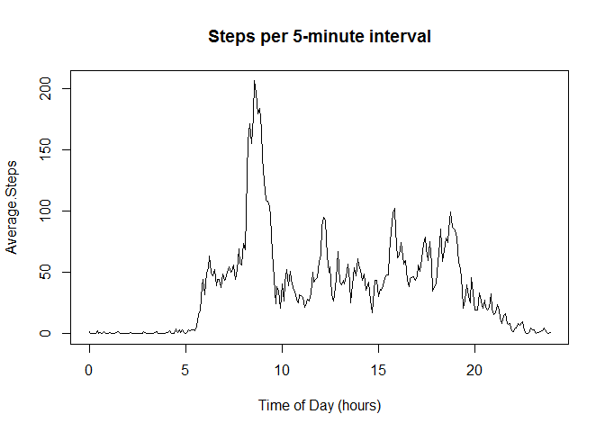
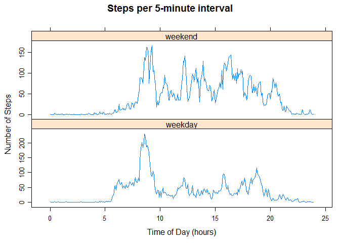

# Reproducible Research: Peer Assessment 1


## Loading and preprocessing the data

Load the data.
Process/transform the data (if necessary) into a format suitable for your analysis


```r
activity <- read.csv('activity.csv')
activity$date <- as.Date(activity$date, "%Y-%m-%d")
```


## What is mean total number of steps taken per day?

Calculate the total number of steps taken per day


```r
if (!require('dplyr')){ 
  install.packages('dplyr') 
}
library(dplyr)
activitybydate <- group_by(activity, date)
activitySumByDate <- summarise(activitybydate, stepsPerDay = sum(steps, na.rm = TRUE))
```

Make a histogram of the total number of steps taken each day


```r
hist(activitySumByDate$stepsPerDay)
```

 

Calculate and report the mean and median of the total number of steps taken per day


```r
mn <- mean(activitySumByDate$stepsPerDay, na.rm = TRUE)
md <- median(activitySumByDate$stepsPerDay, na.rm = TRUE)
print(paste0("Mean steps/day = ", mn))
```

```
## [1] "Mean steps/day = 9354.22950819672"
```

```r
print(paste0("Median steps/day  = ", md))
```

```
## [1] "Median steps/day  = 10395"
```


## What is the average daily activity pattern?

Make a time series plot of the 5-minute interval (x-axis) and the average number of steps taken, averaged across all days (y-axis)


```r
activityByInterval <- group_by(activity, interval)
activityMeanByInterval <- summarise(activityByInterval, AverageSteps = mean(steps, na.rm = TRUE))
Average.Steps <- ts(activityMeanByInterval$AverageSteps, frequency=12, start = c(0,1))
plot(Average.Steps, type = "l")
```

 

Which 5-minute interval, on average across all the days in the dataset, contains the maximum number of steps?


```r
i <- activityMeanByInterval$interval[which.max(activityMeanByInterval$AverageSteps)]
print(paste0("Interval with max steps = ", i))
```

```
## [1] "Interval with max steps = 835"
```


## Imputing missing values

Calculate and report the total number of missing values in the dataset (i.e. the total number of rows with NAs)


```r
n <- sum(is.na(activity$steps))
print(paste0("Number of missing values = ", n))
```

```
## [1] "Number of missing values = 2304"
```

Devise a strategy for filling in all of the missing values in the dataset, using the mean/median for that day, or the mean for that 5-minute interval, etc.
Create a new dataset that is equal to the original dataset but with the missing data filled in.

(using the median for that 5-minute interval to replce NAs)


```r
intervals <- activity$interval[which(is.na(activity$steps))]
means <- vector()
for (int in intervals){
m <- round(activityMeanByInterval$AverageSteps[which(activityMeanByInterval$interval == int)])
means <- c(means, m)
}
activity$steps[which(is.na(activity$steps))] <- means
```

Make a histogram of the total number of steps taken each day.


```r
activitybydate2 <- group_by(activity, date)
activitySumByDate2 <- summarise(activitybydate2, stepsPerDay = sum(steps))
hist(activitySumByDate2$stepsPerDay)
```

 

Calculate and report the mean and median total number of steps taken per day.


```r
mn <- mean(activitySumByDate2$stepsPerDay)
md <- median(activitySumByDate2$stepsPerDay)
print(paste0("Mean steps/day = ", mn))
```

```
## [1] "Mean steps/day = 10765.6393442623"
```

```r
print(paste0("Median steps/day  = ", md))
```

```
## [1] "Median steps/day  = 10762"
```

Do these values differ from the estimates from the first part of the assignment?

**Yes, they are larger and closer to each other.**

What is the impact of imputing missing data on the estimates of the total daily number of steps?

**The daily estimates are more normally distributed and slightly larger, with more being near the mean (smaller sd)**


## Are there differences in activity patterns between weekdays and weekends?

Use the dataset with the filled-in missing values for this part. Create a new factor variable in the dataset with two levels – “weekday” and “weekend” indicating whether a given date is a weekday or weekend day.


```r
day <- weekdays(activitySumByDate2$date, abbreviate = TRUE)
day<- factor(day)
levels(day) = c("weekday","weekday", "weekend", "weekend", "weekday", "weekday", "weekday")
activitySumByDate2$day <- day
```

Make a panel plot containing a time series plot of the 5-minute interval (x-axis) and the average number of steps taken, averaged across all weekday days or weekend days (y-axis). 


```r
if (!require('lattice')){ 
  install.packages('lattice')
}
library(lattice)
xyplot(stepsPerDay ~ date | day, data = activitySumByDate2, type = "l", layout = c(1, 2))
```

 


